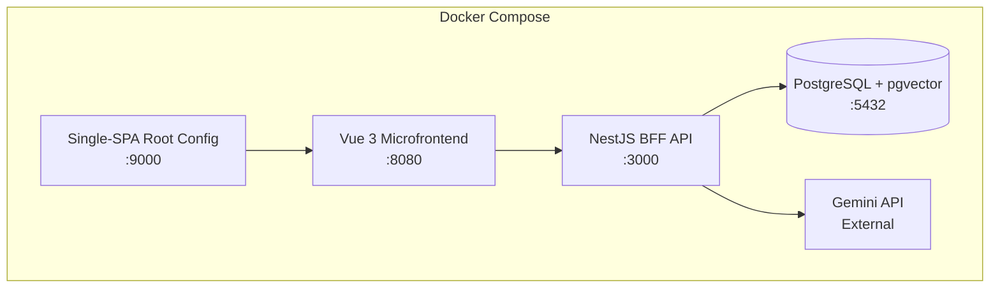

# Starian Technical Challenge: People CRUD (Projuris Acordos)

CRUD de cadastro de pessoas com **NestJS** (BFF), **Vue 3** (Microfrontend via Single-SPA), **PostgreSQL** (Docker) e uma **feature de IA** para demonstrar mentalidade AI First.

---

## Regras do Projeto

> [!CAUTION]
> **Todos os comandos serão executados manualmente pelo desenvolvedor.** Nenhum comando será auto-executado. Cada comando será apresentado com explicação do que faz e por que é necessário.

> [!IMPORTANT]
> **Modo Professor:** Cada decisão técnica virá acompanhada de uma explicação conceitual relevante para entrevista técnica. Conceitos que o recrutador pode perguntar serão destacados com o badge 🎯.

> [!TIP]
> **IA e Automação:** Usaremos o modelo **Gemini**, o banco vetorial **pgvector** no PostgreSQL para features de semântica, e a plataforma de agentes **skills.sh** para carregar guidelines de boas práticas no projeto.

---

## Arquitetura Geral



### Estrutura de Pastas (Monorepo via NPM Workspaces)

```
starian/
├── package.json                # NPM Workspaces Root
├── docker-compose.yml          # Orquestra todos os serviços
├── .env.example                # Template de variáveis de ambiente
├── README.md                   # Instruções de execução
├── .cursorrules                # Arquivo global de contexto para AI-Assisted Dev
├── ai-prompts/                 # Repositório de prompts e exemplos usados na geração
│   ├── generate-crud.md
│   └── code-review-checklist.md
│
├── api/                        # Backend - NestJS BFF
│   ├── Dockerfile
│   ├── src/
│   │   ├── main.ts
│   │   ├── app.module.ts
│   │   ├── people/             # Feature Module
│   │   │   ├── people.module.ts
│   │   │   ├── people.controller.ts
│   │   │   ├── people.service.ts
│   │   │   ├── people.entity.ts
│   │   │   ├── dto/
│   │   │   │   ├── create-person.dto.ts
│   │   │   │   └── update-person.dto.ts
│   │   │   └── validators/
│   │   │       └── cpf.validator.ts   # Validação manual
│   │   ├── ai/                 # AI Module
│   │   │   ├── ai.module.ts
│   │   │   ├── ai.service.ts
│   │   │   └── ai.controller.ts
│   │   └── common/
│   │       ├── filters/
│   │       │   └── http-exception.filter.ts
│   │       └── interceptors/
│   │           └── transform.interceptor.ts
│   └── test/
│
├── spa-people/                 # Frontend - Vue 3 Microfrontend
│   ├── Dockerfile
│   ├── src/
│   │   ├── main.ts             # Lifecycle exports (bootstrap, mount, unmount)
│   │   ├── App.vue
│   │   ├── components/
│   │   │   ├── PersonForm.vue
│   │   │   ├── PersonList.vue
│   │   │   ├── PersonCard.vue
│   │   │   └── ui/             # Design System atoms
│   │   │       ├── BaseInput.vue
│   │   │       ├── BaseButton.vue
│   │   │       └── BaseToast.vue
│   │   ├── composables/        # Lógica reutilizável
│   │   │   ├── usePeople.ts
│   │   │   ├── useCpfValidator.ts
│   │   │   └── usePhoneMask.ts
│   │   ├── services/
│   │   │   └── api.ts          # Axios instance + interceptors
│   │   ├── stores/
│   │   │   └── people.store.ts # Pinia store
│   │   ├── types/
│   │   │   └── person.ts       # Interfaces TypeScript
│   │   └── utils/
│   │       ├── cpf.ts           # Algoritmo CPF
│   │       └── masks.ts
│   └── vite.config.ts
│
└── root-config/                # Single-SPA Orchestrator
    ├── src/
    │   ├── index.ejs           # HTML template com Import Map
    │   └── root-config.ts      # Registro de microfrontends
    └── webpack.config.js
```

---

## Respostas às Dúvidas

### 🔹 Como gerenciar o Monorepo?

Usaremos **NPM Workspaces**, nativo do Node.js moderno. Não exige instalação do `pnpm` ou `yarn` pela equipe recrutadora, o que garante que o projeto será avaliado sem atritos.

🎯 **Conceito de Entrevista: "Por que não usar o CLI do NestJS como monorepo?"**
> O modo monorepo do Nest (`nest-cli.json` com `apps` e `libs`) foi projetado exclusivamente para código servidor (NestJS). Nós temos aplicações díspares: um build Vite (Vue), um root config SystemJS, e o BFF NestJS. Usar o gerenciamento de workspaces no nível do package manager engloba tudo corretamente.

---

### 🔹 Adicionando Skills com skills.sh

Vamos importar configurações nativas de especialistas para ajudar no AI-Assisted Development desse projeto. Usaremos o comando `npx skills add` fornecido pelo ecosistema.

---

### 🔹 Como iremos iniciar o Frontend (Vue 3)?

Usaremos **Vite** como bundler para o microfrontend Vue 3, com o plugin **`vite-plugin-single-spa`** para integrá-lo ao ecossistema single-spa.

**Por que Vite e não Webpack?**
- Vite usa **ESBuild** para desenvolvimento (10-100x mais rápido que Webpack).
- Hot Module Replacement (HMR) quase instantâneo.
- A Starian pode estar migrando de Vue 2 (Webpack) para Vue 3 (Vite), então demonstrar conhecimento nos dois demonstra versatilidade.

🎯 **Conceito de Entrevista: "O que é HMR e por que importa?"**
> HMR (Hot Module Replacement) é a capacidade do bundler de atualizar módulos no browser sem recarregar a página inteira. Isso preserva o estado da aplicação durante o desenvolvimento, aumentando a produtividade. Vite implementa isso via ESModules nativos do browser, enquanto Webpack usa uma camada de WebSocket.

---

### 🔹 Como iremos iniciar o Backend/BFF (NestJS)?

Usaremos o **NestJS CLI** para scaffolding, seguido de geração de módulos via CLI.

**Por que NestJS é um BFF e não um "backend puro"?**
Um BFF (Backend for Frontend) é uma camada de API projetada especificamente para atender as necessidades de uma interface. Em vez de ter uma API genérica, o BFF agrega, transforma e adapta dados para o que o frontend precisa.

🎯 **Conceito de Entrevista: "Qual a diferença entre um BFF e uma API REST tradicional?"**
> Um BFF é uma API dedicada a um frontend específico. Enquanto uma API REST genérica serve múltiplos consumers (mobile, web, terceiros), o BFF é otimizado para as views e fluxos de uma interface particular. Isso reduz over-fetching (receber dados demais) e under-fetching (precisar de múltiplas chamadas), melhorando a performance da UI.

---

### 🔹 Boas Práticas de Código Relevantes para a Vaga

#### Backend (NestJS)

| Prática | Como Aplicaremos | Por que Importa |
|---|---|---|
| **DTOs (Data Transfer Objects)** | `CreatePersonDto`, `UpdatePersonDto` com `class-validator` | Separa a forma dos dados da entidade do banco. O recrutador vai olhar se você valida inputs. |
| **Repository Pattern** | TypeORM repositories injetados no Service | Desacopla a lógica de negócio do banco de dados. Facilita trocar PostgreSQL por outro DB. |
| **Global Exception Filter** | `HttpExceptionFilter` customizado | Padroniza as respostas de erro da API. Demonstra maturidade. |
| **Transform Interceptor** | Envolve todas as respostas em `{ data, statusCode, message }` | Consistência na API. O frontend sempre sabe o formato da resposta. |
| **Validation Pipe global** | `app.useGlobalPipes(new ValidationPipe())` | Valida automaticamente todos os DTOs. Zero chance de dados inválidos chegarem ao Service. |
| **Environment Config** | `@nestjs/config` com `.env` | Separa configuração de código. Essencial para Docker/CI-CD. |

#### Frontend (Vue 3)

| Prática | Como Aplicaremos | Por que Importa |
|---|---|---|
| **Composables (`use*`)** | `usePeople()`, `useCpfValidator()`, `usePhoneMask()` | Lógica reutilizável separada dos componentes. Padrão oficial Vue 3. |
| **`<script setup>`** | Em todos os componentes | Sintaxe moderna, menos boilerplate, melhor inferência TypeScript. |
| **Componentização atômica** | `BaseInput`, `BaseButton`, `BaseToast` | Demonstra capacidade de criar design systems. Componentes pequenos e focados. |
| **Tipagem forte** | Interfaces em `types/person.ts` | TypeScript não é opcional para a Starian. Tipar props, emits e stores. |
| **Pinia Store** | `people.store.ts` com actions e getters tipados | State management oficial do Vue 3. Substitui Vuex. |
| **Services Layer** | `api.ts` com Axios interceptors | Centraliza chamadas HTTP. Interceptors tratam erros globalmente. |

🎯 **Conceito de Entrevista: "O que é o princípio de Single Responsibility aplicado a componentes Vue?"**
> Cada componente deve ter uma única razão para mudar. O `PersonForm` cuida APENAS do formulário. O `PersonList` cuida APENAS da listagem. Se você precisa de lógica compartilhada (ex: validação de CPF), ela vai para um composable, não se duplica entre componentes.

---

### 🔹 Feature de IA — Backend Vetorial com pgvector + Gemini

Vamos implementar uma **"Busca Semântica de Perfis"**.
O usuário poderá digitar:
- *"pessoas focadas em desenvolvimento frontend"*
- *"perfis sênior que entendem de nuvem e AWS"*  

**Como funciona o fluxo vetorial e Gemini?**
1. Ao cadastrar uma `Person` com uma "Bio/Resumo" fictícia, enviamos o texto para a API de Embeddings do **Gemini** (ex: `text-embedding-004`).
2. O Gemini retorna um vetor (array de floats).
3. Salvamos a `Person` no PostgreSQL com um campo `vector` graças à extensão **`pgvector`**.
4. Quando o usuário busca uma frase, ela vira um vetor e o banco faz uma busca por similaridade de cosseno (Cosine Similarity).

**Por que **Gemini** e **pgvector**:**
- O banco continua o mesmo (PostgreSQL), não é necessário adicionar Pinecone ou Qdrant na arquitetura do teste (arquitetura resiliente e simplificada com Docker).
- Demonstra uso avançado de banco relacional e estado da arte de integração IA.

🎯 **Conceito de Entrevista: "Qual é a vantagem do PgVector em relação a uma query de LIKE no PostgreSQL?"**
> O `LIKE` ou `ILIKE` pesquisa pela correspondência exata das palavras. O `pgvector` indexa embeddings (representações matemáticas de significado geradas pela IA). Assim, a pesquisa entende o **contexto** em vez da string. Buscar "Frontend" retornará pessoas cuja bio diz "React" "Vue" "Interface User", mesmo que não tenha a palavra Frontend escrita.

---

## Fases de Execução

### Fase 1 — Infraestrutura (Concluído)
- [x] Criar `docker-compose.yml` (PostgreSQL + volumes)
- [x] Criar `.env.example`
- [x] Scaffolding do NestJS (`api/`)

### Fase 2 — Backend (BFF) (Concluído)
- [x] Configurar TypeORM + PostgreSQL
- [x] Criar `Person` entity
- [x] Criar DTOs com `class-validator`
- [x] Implementar validação manual de CPF
- [x] Implementar `PeopleService` (CRUD completo)
- [x] Implementar `PeopleController` com Pipes e Filters
- [x] Implementar Global Exception Filter
- [x] Implementar Transform Interceptor
- [x] Embutir Testes unitários

### Fase 3 — Feature de Inteligência Artificial (Concluído)
- [x] Implementar `AiModule`
- [x] Gerar Embeddings (Gemini SDK) via `people.service.ts` após inserção
- [x] Lógica de filtragem limpa com class-transformer
- [x] Provar busca semântica em tempo real `<=>` cosine similarity

### Fase 4 — Frontend Reactivo (Atual)
- [ ] Construir toda interface responsiva e premium conectando-se ao BFF.
