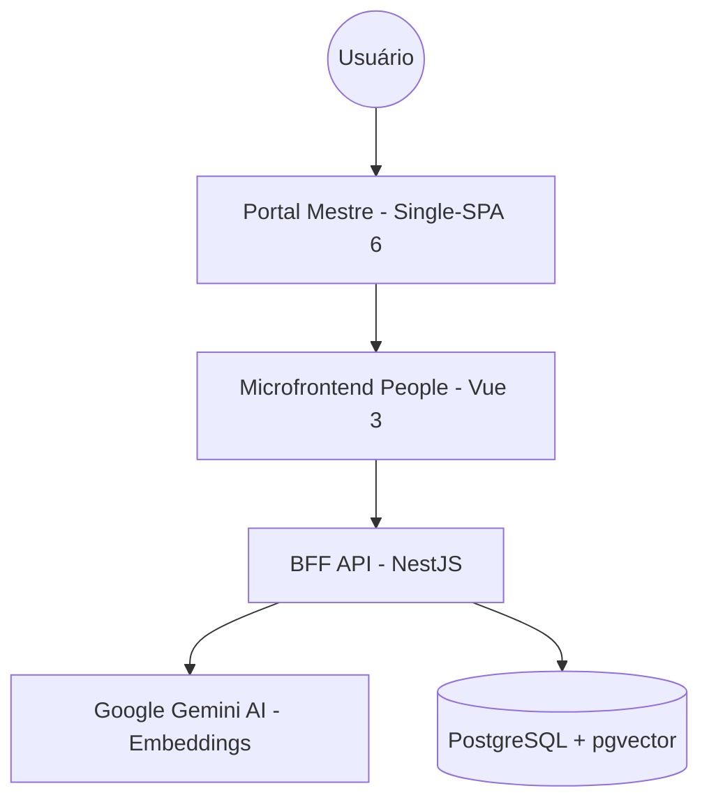

# Starian AI Force — Gestão Stelar de Talentos

> **Desafio Técnico Starian** — Sistema de gestão de profissionais com arquitetura de **Microfrontends**, BFF em **NestJS** e busca semântica via **IA Vetorial (Google Gemini)**.

---

## 🚀 Guia Rápido: Como Rodar (Modo Standalone)

Se você está em ambiente Windows ou quer apenas testar as funcionalidades sem a complexidade do orquestrador, siga estes passos para rodar o app diretamente na porta **8080**.

### 1. Requisitos
- Node.js 20+
- Docker Desktop (para o Banco de Dados)
- Chave de API do Gemini (`GEMINI_API_KEY`)

### 2. Configuração do Ambiente
Crie um arquivo `.env` na pasta `api/` com os seguintes dados:
```env
DB_HOST=localhost
DB_PORT=5432
DB_USER=postgres
DB_PASSWORD=postgres
DB_NAME=starian_db
GEMINI_API_KEY=SUA_CHAVE_AQUI
PORT=3000
```

### 3. Subir o Banco de Dados
Na raiz do projeto, suba apenas o serviço de banco:
```bash
docker-compose up -d db
```

### 4. Rodar o Backend (API)
Em um novo terminal, na raiz do projeto:
```bash
npm install
npm run start:dev -w api
```

### 5. Rodar o Frontend (SPA)
Em outro terminal, na raiz do projeto:
```bash
npm run dev -w spa-people
```

### 6. Acessar a Aplicação
Abra o seu navegador em:
👉 **http://localhost:8080**

---

## 🏗️ Arquitetura do Sistema



### Diferenciais Técnicos:
- **Orquestração Single-SPA**: Carregamento dinâmico sem acoplamento de build.
- **Busca Semântica Híbrida**: Bio de profissionais convertida em vetores (`text-embedding-001`) para busca por similaridade de cosseno.
- **UX Premium**: Design "Ultra Dark" com glassmorphism e máscaras de formulário reativas.
- **Resiliência**: Fallback automático para busca textual (`ILIKE`) caso a IA esteja indisponível.

---

## 🛠️ Stack Tecnológico

| Camada | Tecnologias |
|---|---|
| **Orquestrador** | Single-SPA 6 + Webpack 5 + SystemJS |
| **Microfrontend** | Vue 3 (Composition API + `<script setup>`) + Vite 8 |
| **Estilo** | Tailwind CSS v4 (Starian Brand) |
| **BFF** | NestJS + TypeORM |
| **Banco de Dados** | PostgreSQL 15 + pgvector |
| **IA** | Google Gemini API (Model: `gemini-embedding-001`) |
| **Infra** | Docker Compose |

---

## 🧠 Busca Inteligente com IA

A `bio` de cada profissional é processada para gerar um **vetor de 768 dimensões**, permitindo encontrar talentos pelo contexto:
- **Exemplo**: Ao buscar por *"Cientista de Dados"*, o sistema encontrará profissionais com bio sobre *"algoritmos"*, *"machine learning"* ou *"estatística"*, mesmo que o termo exato não esteja presente.
- **Re-ranking**: Resultados com termos exatos no nome ou Bio são promovidos para garantir o equilíbrio entre contexto e precisão.

---

## 🧪 Testes e Qualidade

O sistema conta com **31 testes unitários** focados na integridade da lógica de negócios:
- Validação manual de CPF e E-mail.
- Casos de borda no `PeopleService` (duplicatas, fallbacks de IA).
- Simulação de fluxos de Embedding no `AiService`.

```bash
# Rodar testes do BFF
npm run test -w api
```

---

## 🐳 Docker (Ambiente Inteiro)
Para rodar a arquitetura completa com orquestração automática:
1. Pare todos os terminais locais.
2. Certifique-se de que as portas 3000, 8080 e 9000 estão livres.
3. Rode `docker-compose up --build`.
4. Acesse via porta `9000` (Portal Master).

---

## 📁 Estrutura do Monorepo
```text
starian/
├── api/                    # BFF NestJS + IA
├── spa-people/             # Microfrontend Vue 3 (Gestão de Talentos)
├── root-config/            # Orquestrador Single-SPA (O Maestro)
├── docker-compose.yml      # Infra completa
└── .env                    # Variáveis Ambientais
```
